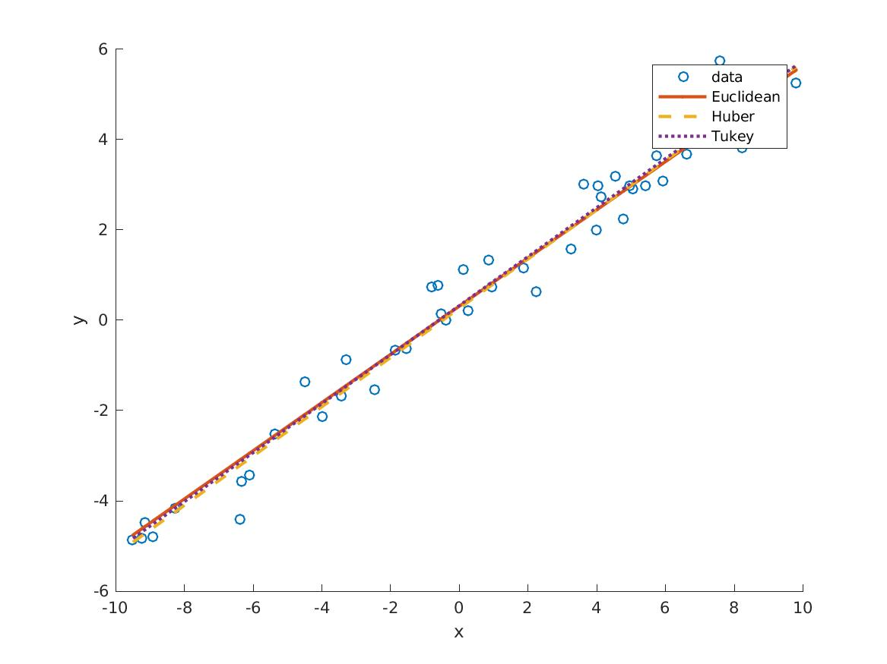
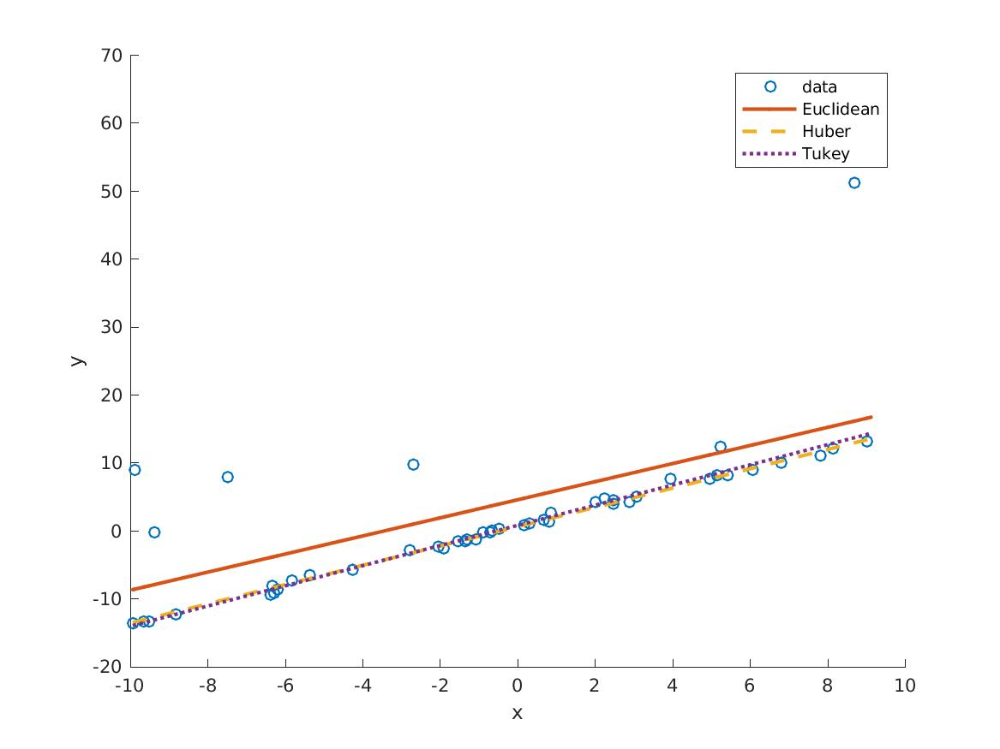
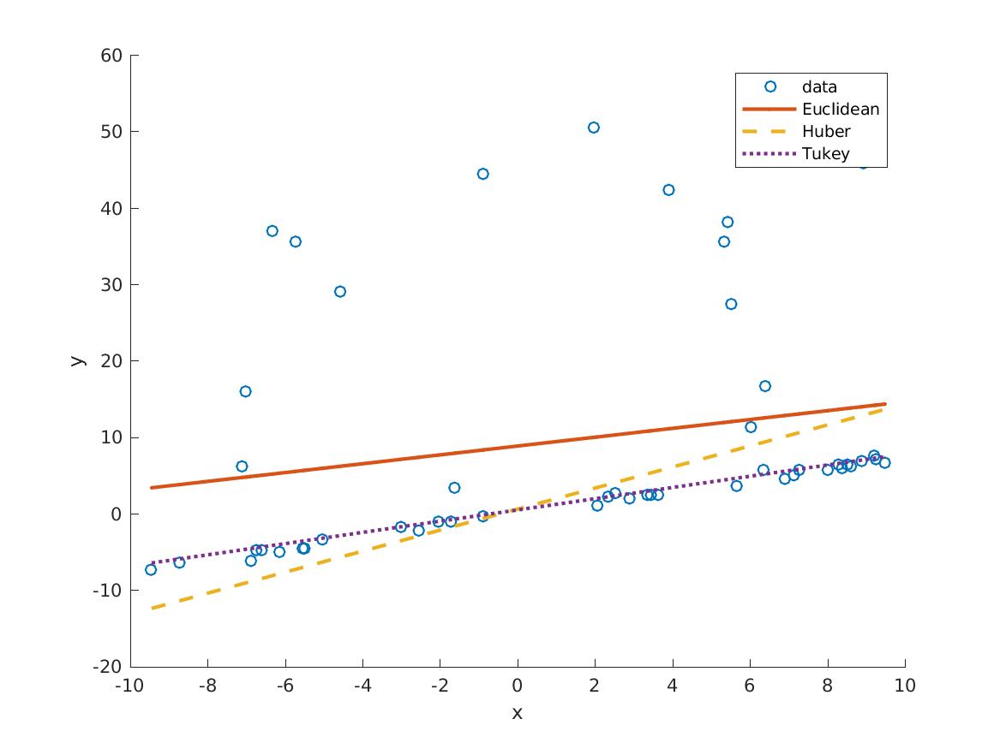

## Robust Losses

This module contains implementations of two "robust" losses, the 
**huber loss** (otherwise known as the smooth L1 loss) and the **tukey loss**, 
a loss derived from 
[Tukey's biweight](http://mathworld.wolfram.com/TukeysBiweight.html).  To 
enable easy comparisons, it also contains an implementation of the 
**euclidean loss** (otherwise known as the L2 loss).

The effectiveness of the `tukey` loss for a range of regression tasks 
is explored in the [paper](https://arxiv.org/abs/1505.06606): 

*Robust Optimization for Deep Regression  
V. Belagiannis, C. Rupprecht, G. Carneiro, and N. Navab,  
ICCV 2015, Santiago de Chile.*

This module makes use of a subset of the public code for 
[deepRegression](https://github.com/bazilas/matconvnet-deepReg).


### Install

The module is easiest to install with the `vl_contrib` package manager:

```
vl_contrib('install', 'mcnRobustLoss', 'contribUrl', 'github.com/albanie/matconvnet-contrib-test/') ;
vl_contrib('setup', 'mcnRobustLoss', 'contribUrl', 'github.com/albanie/matconvnet-contrib-test/') ;
```

The code makes use of the `autonn` module, which can be installed as follows:

```
vl_contrib('install', 'autonn') ;
vl_contrib('setup', 'autonn') ;
```

### Experiments

To understand the effect of using different loss functions for regression, 
we can run a few simple experiments. The code to reproduce these experiments 
can be found in `example/robust_regression.m`. 

We will train three linear models of the form:

 `y = w * x + b`
 
The models will be fitted to generated data points using the loss functions 
defined by `vl_nneuclideanloss`, `vl_nnhuberloss` and `vl_nntukeyloss`.

For our first experiment, suppose we are fitting our models to data without 
outliers which has been generated by a linear model with a small amount of 
Gaussian noise. In this scenario, each of the loss functions drive the weights 
to fit the data in the same way:




Now consider a situation in which there was an issue with the data which 
led to the introduction of anomalous data points. To simulate this case, 
assume that each data point becomes an outlier with probability `0.1`. The 
models trained with robust losses (`huber` and `tukey`) are largely 
unaffected, but the `euclidean` loss model is significantly displaced:



This sensitivity to outliers results from the quadratic growth of the 
Euclidean loss as data points move away from their predicted values.  
We can introduce further outliers (with probability `0.3`) to explore this effect:



In this scenario, the model trained with the `huber` loss is displaced 
while the `tukey` loss remains unaffected (it's extremely robust). 

It's worth noting that robustness to outliers is not necessarily the most 
desirable property of a loss function, so the choice of which is best for a given 
task depends heavily on the distribution of your data.
